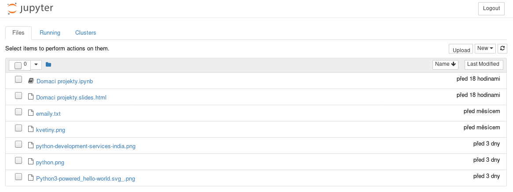
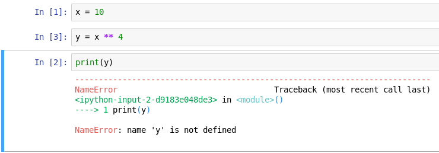
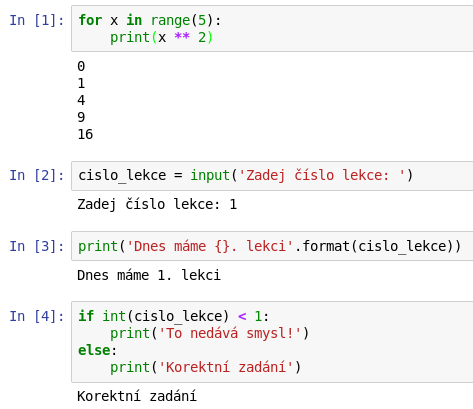
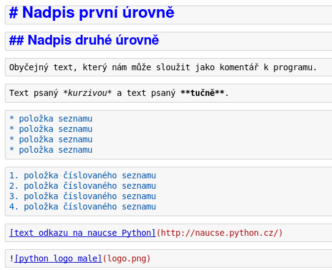
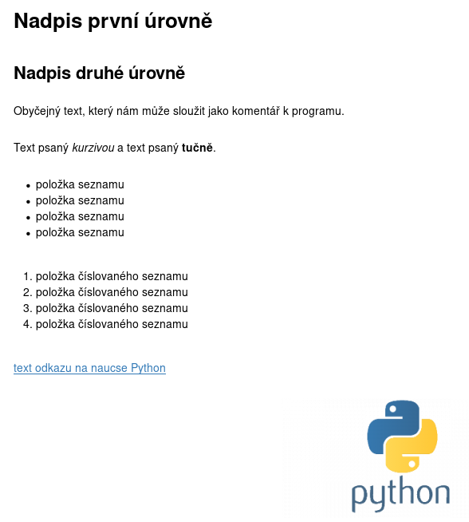

# Jupyter Notebook intro

Jupyter Notebook je webový editor sloužící k vytváření komplexních dokumentů,
které mohou mimo strukturovaného textu a obrázků obsahovat také
kód ([nejen v Pythonu](https://github.com/jupyter/jupyter/wiki/Jupyter-kernels)),
grafy, matematické vzorce (LaTeX) a další interaktivní prvky.

Z jiného pohledu se jedná o velmi praktickou konzoli pro Python, kde je veškerá
historie uložena a dá se k ní vrátit nebo ji změnit, a tím ovlivnit zbytek
výpočtů.

Jupyter Notebook se hodí všude tam, kde potřebuješ ihned vidět výsledky
své práce či postupovat krok za krokem, předat někomu komplexní program spolu
s vizualizacemi a výsledky, připravit si prezentaci či datovou analýzu atp.

## Instalace

Instalace není složitá a zabere jen chvíli. Jako obvykle si ale můžeš
vybrat hned z několika možností.

### Windows

Pokud už máš nainstalovaný Python 3 a vše bez potíží funguje, použij pro instalaci
Jupyter Notebooku [standardní cestu instalace balíčků pro Python](#instalace-pomocí-pipu).

Na Windows je možné nainstalovat Jupyter Notebook i jako součást distribuce
*Anaconda*, která mimo jiné obsahuje i Python samotný a další knihovny užitečné
zejména pro analýzu dat a výzkum. Jak na to se dozvíte [na stránkách projektu](https://www.anaconda.com/download/).

### Linux

Linuxové distribuce často mají Jupyter Notebook připraven ve formě distribučních
balíčků. Například ve Fedoře je to balíček `notebook`:

```shell
$ sudo dnf install notebook
```

V Ubuntu je instalace podobně jednoduchá:

```shell
$ sudo apt install jupyter-notebook jupyter-core
```

Pokud ve tvé distribuci Jupyter Notebook k dispozici není nebo si jej chceš
instalovat do virtuálního prostředí, přejdi na [další kapitolu](#instalace-pomocí-pipu).

### macOS

Na Macu můžeš Jupyter Notebook nainstalovat [pomocí PIPu](#instalace-pomocí-pipu),
pokud už máš nainstalovaný Python 3 a vše bez potíží funguje.

Druhou možností je použít balíčkovací nástrojem [Homebrew](https://brew.sh/index_cs),
kterým jsi pravděpodobně již instalovala i samotný Python. Pokud ho nemáš, nainstaluj
si jej podle [návodu](https://brew.sh/index_cs#install).

Pokud už Homebrew v počítači máš, můžeš Jupyter Notebook nainstalovat příkazem:

```shell
$ brew install jupyter
```

### Instalace pomocí PIPu

Pokud máš Python 3 již nainstalovaný, můžeš pro instalaci balíčků použít jeho
modul jménem `pip`. Instalovat je možné buď přímo do systému, nebo do konkrétního
virtuálního prostředí. Abychom si ušetřili práci při spouštění notebooku
a abychom jej také měli k dispozici pro všechny naše projekty, nainstalujeme si
jej přímo bez aktivovaného virtuálního prostředí.

Do příkazové řádky zadej následující příkaz:

```shell
python3 -m pip install --user jupyter
```

> Používáš-li Windows, budeš muset pravděpodobně na začátku příkazu použít místo
`python3` jen `python`.

## Spuštění

Po úspěšné instalaci lze Jupyter Notebook spustit jednoduchým příkazem:

```shell
$ jupyter-notebook
```

Po spuštění Notebooku se automaticky spustí i webový prohlížeč, ve kterém se
ti editor zobrazí.

> Notebook pracuje vždy v té složce, ve které byl spuštěn, proto je rozumné
přejít před jeho spuštěním do složky, ve které chceš mít výsledné dokumenty
uloženy.



Na první obrazovce vidíš obsah složky, ve které je Notebook spuštěn. Jakmile
budeš mít nějaké dokumenty vytvořeny, objeví se zde a budeš se k nim moci vrátit
a pokračovat v práci.

Nový dokument vytvoříš tak, že si vpravo nahoře klikneš na `New` > `Python 3`.
Touto volbou vybereš Python 3 jako jazyk, který budeš v rámci dokumentu používat.
Notebook jich zvládne daleko více a tak si na své přijdou úplně všichni.

## Uživatelské rozhraní


Notebook nemá nijak složité rozhraní. Na prvním řádku najdeš informaci o názvu
dokumentu a posledním uložení, pod tím pak ovládací prvky a hlavní nabídku.
Ještě kousek níže pak prázdnou buňku čekající na první obsah.

Vpravo vedle nápisu „Python 3“ je malé, ale užitečné kolečko. Pokud nám během práce
zčerná, znamená to, že je Python zaneprázdněn vykonáváním našich příkazů a je
třeba počkat až jejich provádění dokončí, anebo, pokud jsi například omylem
vytvořil nekonečný cyklus, že je třeba Python (neboli kernel) restartovat.

## Základní použití

Jako první krok si nový dokument přejmenuj. Klikni na prvním řádku na nápis
„Untitled“ a zvol si nějaké smysluplné jméno.

Teď zkus do první buňky napsat nějaký příkaz v Pythonu a stisknout klávesovou
zkratku `Shift` + `Enter`.

> Do jedné buňky lze zapsat libovolně velký kus kódu i s prázdnými řádky, proto
se k jeho spuštění musí místo pouhého Enteru použít klávesová zkratka.
Smysluplnější je ale dělit kód po menších částech, aby se dal lépe kontrolovat.


Podobně můžeš pokračovat i dále. Vždy do buňky vložíš nějaký kód a pak jej
spustíš. Pokud buňka obsahuje nějaký výstup nebo něco vrací, ukáže se výsledek
po spuštění buňky hned pod ní. Pro výstup to ale platí, jen pokud je na posledním
řádku buňky, zatímco `print` může být v buňce kdekoli.


Funguje to jako klasický program, takže záleží na pořadí v jakém se jednotlivé
buňky provedly. Musíš například nejdříve uložit nějaký obsah do proměnné, než ji
budeš moci použít. Tohle pravidlo je důležité mít na paměti, protože buňky
v Notebooku se dají spouštět nezávisle na sobě v libovolném pořadí. V jakém
pořadí k jejich spuštění došlo, se dá zjistit z čísel, která se po spuštění
objeví nalevo. Pokud se po spuštění místo čísla objeví `*`, znamená to, že
Python pracuje a na výsledek si budeme muset chvilku počkat.

Takhle to může vypadat, pokud se správné pořadí nedodrží:



> I když to není nutnost, bývá zvykem psát dokumenty v Notebooku tak, aby se
buňky daly spustit v pořadí, ve kterém jdou za sebou. Když jej pak někomu pošleš,
bude si moci snadno spustit tvůj kód kousek po kousku a sledovat, co se v něm
děje. Mimoto je v hlavní nabídce i možnost `Kernel` > `Restart & Run All`, která
restartuje Python a následně spustí všechny buňky v dokumentu.

Všimni si, jak buňky měni barvu. Pokud je okraj buňky zelený, je možné ji
editovat a pomocí šipek se pohybovat v kódu, který obsahuje. Pokud je modrý, dá
se šipkami přecházet mezi jednotlivými buňkami. Z modrého do zeleného režimu
se dostaneme klávesou `Enter`, případně kliknutím do buňky. Naopak ze zeleného
do modrého režimu pomocí klávesy `Esc`.

Pro ovládání Notebooku je dobré se naučit klávesové zkratky, které práci s ním
usnadní a zrychlí. Jejich seznam je možné zobrazit pomocí klávesy `h`.

> Klávesové zkratky se používají v modrém režimu, jinak bychom místo
speciálních akcí psali jednotlivé znaky do buněk.

Mezi ty nejdůležitější patří:

* `h` zobrazí nápovědu
* `a` vloží novou buňku nad aktuální
* `b` vloží buňku pod aktuální
* `x` vyjme buňku
* `c` kopíruje buňku
* `v` vloží kopírovanou nebo vyjmutou buňku pod aktuální
* `Shift` + `v` vloží kopírovanou nebo vyjmutou buňku nad aktuální
* `Ctrl` + `s` uloží dokument
* `m` přepne buňku z pythonového kódu na text

**Nejdůležitější klávesová zkratka** je hned ta první - `h` - s její pomocí
se totiž velice rychle dostanete k seznamu všech ostatních.

## Typy obsahu

Základním typem buňky je buňka s programem, která umí úplně vše co z Pythonu
už znáš.



### Text

Stiskem klávesy `m` (v modrém režimu) můžeme buňku přepnout z režimu pythonového
kódu do režimu textu, který nám umožní dokumenty obohatit o spoustu různého obsahu.
Že je buňka v textovém režimu, poznáme podle toho, že nalevo od ní už nebude modré
označení `In [ ]`. Zatímco u buňek s Pythonem se nám po spuštění programu výsledek
vypíše pod buňku, textová buňka se po spuštění pouze vykreslí ve formě textu.

### Markdown

Obyčejný text by sám o sobě nebyl tak zajímavý a k přehlednosti nepřispěje o nic
více než obyčejný komentář. Proto máme možnost jej formátovat a do jisté míry
tak upravit jeho vzhled, ale hlavně strukturu. K formátování se používá
značkovací jazyk [Markdown](https://cs.wikipedia.org/wiki/Markdown). Markdown
umožňuje formátovat text pomocí obyčejných znaků.

Například:

* Text začínající `#` se po spuštění buňky stane automaticky nadpisem první
úrovně. `##` pak udělají druhou úroveň atd.
* Když text uvodíme hvězdičkami – `*třeba takto*` – bude napsán *kurzivou*.
Dvojice hvězdiček na každé straně pak udělá text **tučný**.
* Když bude několik řádků začínat hvězdičkou, stane se z nich seznam s odrážkami.
Když na začátku použijeme čísla, bude seznam číslovaný.
* Odkazy vypadají takto: `[text odkazu](cesta či URL adresa)` – do hranatých
závorek na začátek se napíše text odkazu a do kulatých závorek pak cesta k cíli
či URL adresa.
* Obrázky vypadají téměř stejně jako odkazy, jen mají na začátku před první
hranatou závorkou vykřičník: ``

Tímto způsobem jednoduše formátovaný text by mohl vypadat následovně:



Výsledek takového formátování pak může po spuštění buňek vypadat například
takto:



### LaTeX

Pokud potřebuješ zapsat do dokumentu nějaké rovnice či vzorce, můžeš k tomu
použít LaTeX. Latexovou formuli stačí začít a ukončit pomocí `$$`.

Například zápis `$$ c = \sqrt(a^2 + b^2)$$` bude po spuštění buňky vypadat takto:


## Úkol

To je pro dnešek vše. Pojďme si zkusit naprogramovat něco konkrétního, na čem si
práci s Notebookem budeme moci vyzkoušet a vyřešit případné problémy či
nejasnosti.

Zkus si naprogramovat v Jupyter Notebooku jednoduchou textovou hru. Bude to
známá hra **Kdo, s kým, kde a co dělali?**. Tvým úkolem bude naprogramovat celou
hru s následujícím průběhem:

* Hra se uživatele zeptá na otázku (např. „Kdo?“) a nechá ho odpovídat, dokud se
mu bude chtít. Konec odpovídání na nějakou otázku může být signalizován třeba
odpovědí „konec“.
* Po té hra přejde na další otázku v řadě - „S kým?“. 
* Tohle se bude opakovat, dokud hra nedostane odpovědí na všechny čtyři otázky.
* Z odpovědí pak vybere náhodou odpověď pro každou část, ze které následně složí
výslednou větu.

Řešení je samozřejmě k dispozici jako [Jupyter Notebook](solutions/solution.ipynb)
a také jako [HTML soubor](solutions/solution.html) k nahlédnutí.
